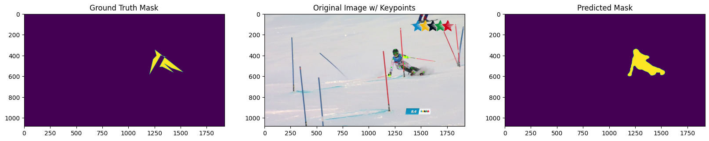

# HumanSegmentation Pose2Seg Ski2DPose

### Project Description
This project aims to reproduce and analyze the results from the paper "[Pose2Seg: Detection Free Human Instance Segmentation](https://github.com/liruilong940607/Pose2Seg)" and adapt the model to work with the [Ski2DPose Dataset](https://www.epfl.ch/labs/cvlab/data/ski-2dpose-dataset/). It includes a qualitative analysis of the segmentations generated by the model.

The primary goal is to understand the methodology proposed in the paper, validate its reproducibility, and assess its adaptability to a different dataset. This work was conducted as part of the Machine Learning course at the University of Udine.

---

### Examples Figure w/ bbox & joints


### Examples Segmentation w/ keypoints



---

### Table of Contents
1. [Introduction](#introduction)
2. [Repository Structure](#repository-structure)
3. [Requirements](#requirements)
4. [Installation](#installation)
5. [Usage](#usage)
6. [Results](#results)
7. [Future Work](#future-work)
8. [Authors](#authors)

---

### Introduction
Pose2Seg is a model that uses human pose information to guide instance segmentation without relying on a detection step. This project reproduces the model's original results, adapts it to the Ski2DPose dataset, and evaluates its generalization capabilities.

---

### Repository Structure
- **`src/`**: Source code for training and testing.
- **`notebooks/`**: Jupyter or Colab notebooks used during the project.
- **`data/`**: Scripts and examples for downloading and preprocessing the Ski2DPose dataset.
- **`results/`**: Outputs such as segmentation masks, charts, and test logs.
- **`docs/`**: Additional documentation.
- **`README.md`**: Project overview and user guide.
- **`LICENSE`**: License file for the project.
- **`requirements.txt`**: List of dependencies for the project.

---

### Requirements
Ensure you have the following installed:
- Python 3.8 or later
- PyTorch
- OpenCV
- Polygon
- pycocotools
- Google Colab (optional but recommended)

Install dependencies by running:
```
pip install -r requirements.txt
```

---

### Installation
1. Clone the repository:
   ```
   git clone https://github.com/your-username/Pose2Seg-Ski2DPose-Analysis.git
   cd Pose2Seg-Ski2DPose-Analysis
   ```
2. Download and preprocess the Ski2DPose dataset following the instructions in `data/README.md`.
3. Ensure all paths in the configuration file (`config.json`) are correctly set.

---

### Usage
1. **Train the Model**  
   Train the original Pose2Seg model:
   ```
   python src/train.py --config config.json
   ```

2. **Adapt the Dataset**  
   Convert the Ski2DPose dataset to COCO format:
   ```
   python src/adapt_dataset.py --input data/ski2dpose --output data/coco_format
   ```

3. **Test the Model**  
   Evaluate the adapted model on the Ski2DPose dataset:
   ```
   python src/test.py --weights results/last.pkl --dataset ski2dpose
   ```

---

### Results
- **Reproducibility Metrics**: Reproduced results on the COCO dataset closely match those reported in the original paper.
- **Qualitative Analysis**: Segmentations on the Ski2DPose dataset demonstrate good generalization capabilities, with some limitations in complex scenarios.

Examples of outputs are available in the `results/` folder.

---

## Documentation

For more detailed information, you can read the [project report](docs/report.pdf).

---

### Future Work
- Extend training epochs to enhance performance.
- Compare performance with other pose-based segmentation methods.
- Experiment with different GPUs to improve computation time.

---

University of Udine  
Master's Degree in Artificial Intelligence, Industrial Automation & IoT  
Academic Year 2022/2023
